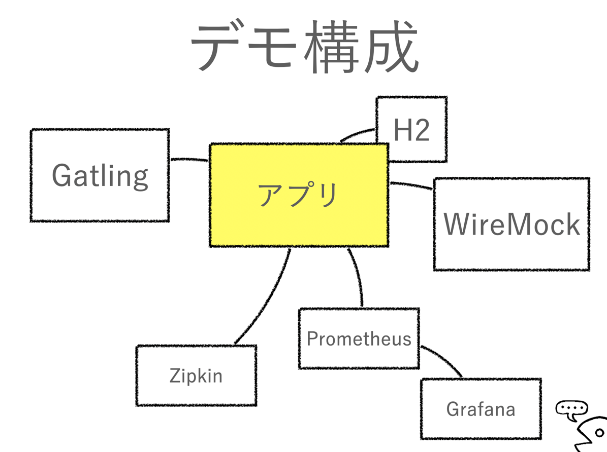

JJUG CCC 2023 Fall Gatlingによる負荷テスト入門
============================================================

ローカル端末だけで全部動きます。
スライドにも記述していますが、インフラなど含まない本番と乖離した状態のため、負荷テストとしては適切ではないです。
アプリケーション単体の動作確認や、負荷テストツールの勉強用と割り切って使用してください。

## 資料
[Gatlingによる負荷テスト入門 - Speaker Deck](https://speakerdeck.com/irof/gatlingniyorufu-he-tesutoru-men)

### セッション概要
負荷テストをやったことない人から雰囲気でやっている人向けの入門セッションです。
前半は負荷テストの考え方を、後半はGatlingの紹介と説明、デモをしようと思います。

以前のGatlingはScalaで書くものでしたが、少し前からJavaでも書けるようになり、Javaなプロダクトで導入しやすくなっています。

## デモ



### 準備

Dockerで色々起動。

```shell
docker compose up
```

起動したらGrafana見たい人はダッシュボードの準備とかしてください。しなくても動きはするので、わからなければスルーでOK。

ぜんぶ起動してない状態でアプリを起動すると「Zipkinに送信しようとしたけど届かないよ」とかエラー出ますが、気にしないなら起動完了待たなくてもいいです。

アプリを起動。

```shell
./gradlew bootRun
```

Grafanaがセットアップできていない場合は、スレッドやメモリを見れる何か（`visualvm` でも `jmc` でもお好きなものでOK）を起動しておくと良いです。

### 動作確認

- `curl` とかブラウザとかで http://localhost:8080 を叩く。
  - `hello` が返ってくればOK。
- もいいですが、こういう時に `ab` とかも。

```shell
ab -n 100 -c 20 http://localhost:8080/external
```

- トレース http://localhost:9411/zipkin/
  - trace IDはログに出してるので気になるのがあったらそれ開くとか。

### Gatling実行

````shell
./gradlew gatlingRun-DemoSimulation
````

このデモはアクティブユーザー数をコロコロ変えるのがテーマです。
アクティブユーザー数変遷を意図通りに描けると負荷テスト捗ります。
実際こんなInjectionが欲しくなることはそんなにないはずですが。

`DemoSimulation` の部分はほかに以下。
- `SlideSimulation`
- `HealthSimulation`
- `PatternSimulation -Dpattern=db`
  - `simple`, `db`, `external`, `sleep` が使えます

内容は各Simulationやクラスのコメントを参照してください。
